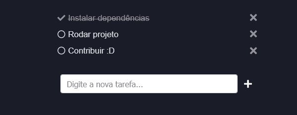

# todo-app-react
To-do list funcional feito em react. [Veja a mesma aplicação feita em vue.js](https://github.com/pedrogustavo/todo-app-vue)

Aplicação simples onde você pode adicionar, remover e concluir tarefas. **Uma aplicação 100% funcional e pronta para o uso.**   
Os dados _são salvos no localStorage, então mesmo que seja feito um refresh da tela ou feche o browser seus dados não serão perdidos pois ficam salvos no seu browser._

URL para acessar a aplicação: https://pedrogustavo.github.io/todo-app-react/



## Rodando o projeto local
Para rodar o projeto, basta acessar o diretório raiz e instalar as dependências utilizando:
```
npm install
```

### Rodando o projeto com hot-reload para desenvolvimento
```
npm start
```

### Compilando e minificando para produção
```
npm run build
```

### Deploy para o gh pages
```
npm run deploy
```
## Construído com
- [create-react-app](https://create-react-app.dev/)
- [react v17.x.x](https://pt-br.reactjs.org/)
- [react-redux](https://react-redux.js.org/)
- [react-router](https://reactrouter.com/)
